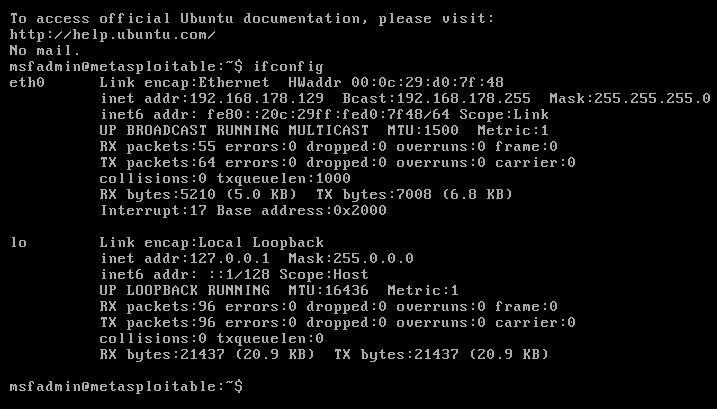

# Cybersecurity-Projects
My beginner cybersecurity lab projects: Nmap, Metasploit, Wireshark, etc. 
| Project 1 – Network Reconnaissance Lab |
Tools Used: Kali Linux, Metasploitable 2, Nmap, Metasploit  

Description:  
- Set up a virtual penetration testing lab  
- Found target IP and tested connectivity (ping)  
- Ran Nmap scan (`-sV -Pn`) to identify open ports and services  
- Documented network exposure and potential risks  

Screenshots:
**Nmap Scan:**  

**Metasploit Output:**  

